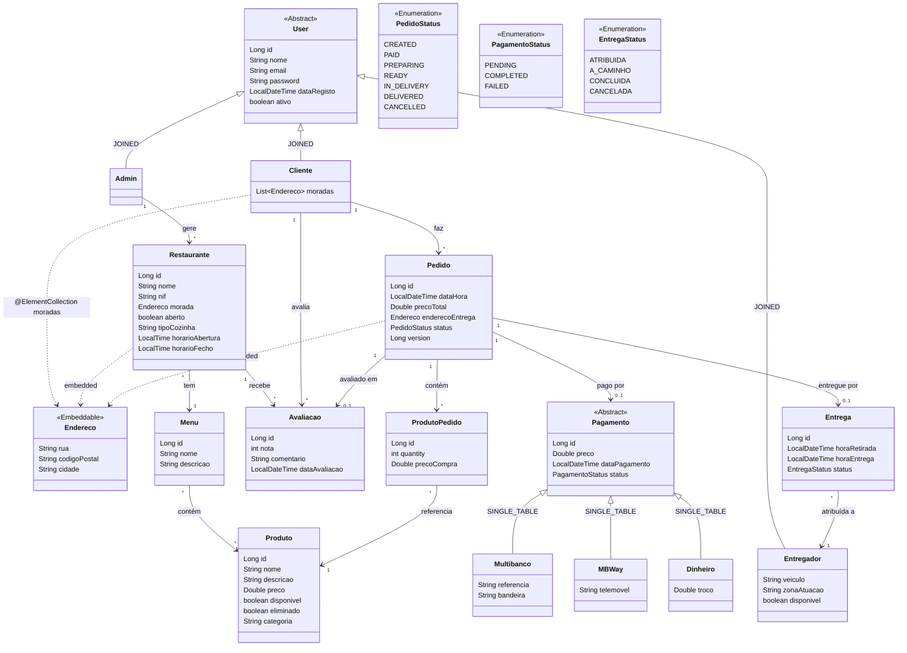
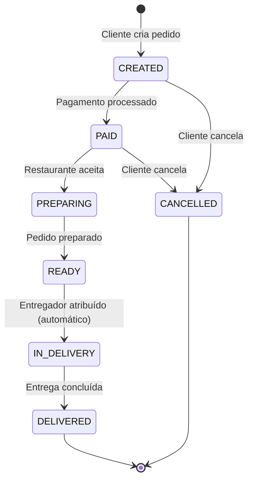
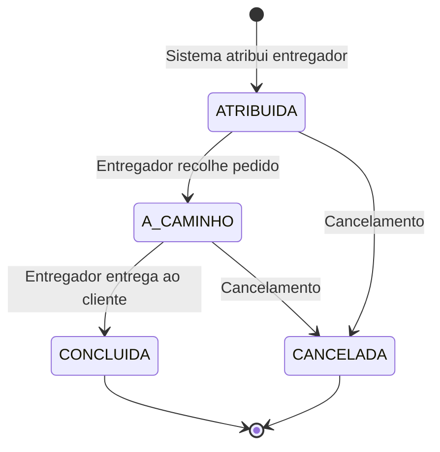

# TascaEats — Modelo de Domínio (Fase 2)

## Diagrama de Classes

## Fluxo de Estados do Pedido

## Fluxo de Estados da Entrega

## Notas de Design

| Decisão | Justificação |
|---------|-------------|
| `Produto.disponivel` é por restaurante | Cada produto pode pertencer a vários menus e restaurantes via relação N:N. A disponibilidade é um atributo do produto, verificado no contexto do restaurante que o serve. |
| Popularidade de produto por restaurante | A popularidade (nº vezes pedido) é contabilizada nos `ProdutoPedido` que referenciam o produto; pode ser filtrada por restaurante via os menus desse restaurante. |
| Restaurante com 1 menu | Cada restaurante tem exatamente um menu (N:1). Um menu pode ser partilhado por vários restaurantes (franchising). Não existe histórico de menus anteriores. |
| `Multibanco.bandeira` | Refere-se ao provedor do serviço de cartão: Mastercard, Visa, American Express, etc. |
| Filtros com controlo de acesso | Os filtros respeitam os casos de uso. Exemplo: só o administrador pode pesquisar e filtrar Clientes. |
| Produtos pertencem a Menus (não a Restaurante diretamente) | `Produto` não tem `restaurante_id`. O acesso ao catálogo de um restaurante é feito via `Restaurante → menu → produtos`. Quando um produto é adicionado via `criarProduto(restauranteId, ...)`, o serviço encontra (ou cria) o menu do restaurante e aí adiciona o produto. |

## Estratégias de Herança JPA

| Hierarquia | Estratégia | Justificação |
|-----------|------------|----------|
| `User` → Cliente, Admin, Entregador | **JOINED** | Subtipos com atributos distintos; queries frequentes por subtipo; melhor normalização |
| `Pagamento` → Multibanco, MBWay, Dinheiro | **SINGLE_TABLE** | Poucos campos diferenciadores; queries polimórficas frequentes; melhor performance |
| `Endereco` em Restaurante, Pedido | **@Embedded** | Value object reutilizável; sem tabela própria; colunas ficam inline na tabela dona |
| `Endereco` em `Cliente.moradas` | **@ElementCollection** | Múltiplas moradas por cliente; JPA gera tabela `cliente_moradas` automaticamente; `Endereco` mantém-se `@Embeddable` sem necessidade de entidade própria |

## Relações Principais

| De | Para | Cardinalidade | Notas |
|----|------|--------------|-------|
| Cliente | Endereco (moradas) | @ElementCollection | Várias moradas por cliente; tabela `cliente_moradas` gerada pelo JPA |
| Cliente | Pedido | 1:N | Cliente faz vários pedidos |
| Cliente | Avaliacao | 1:N | Cliente faz várias avaliações |
| Admin | Restaurante | 1:N | Admin gere vários restaurantes |
| Entregador | Entrega | 1:N | Entregador faz várias entregas |
| Restaurante | Menu | N:1 | Restaurante tem exatamente um menu; o mesmo menu pode ser partilhado por vários restaurantes (franchising); FK `menu_id` na tabela `restaurante` |
| Restaurante | Avaliacao | 1:N | Restaurante recebe várias avaliações |
| Menu | Produto | N:N | Menu contém vários produtos; produto pode estar em vários menus |
| Pedido | ProdutoPedido | 1:N | Pedido contém vários items (possivelmente de restaurantes diferentes) |
| ProdutoPedido | Produto | N:1 | Item referencia um produto (restaurante inferido via produto) |
| Pedido | Pagamento | 1:1 | Pedido tem um pagamento |
| Pedido | Entrega | 1:1 | Pedido tem uma entrega |
| Pedido | Avaliacao | 1:1 | Pedido pode ter uma avaliação |

## Alterações face à Fase 1

| Alteração | Detalhe |
|-----------|---------|
| ~~`Pedido → Restaurante` (N:1)~~ | **Removida** — pedido pode conter produtos de vários restaurantes; restaurante inferido via `ProdutoPedido → Produto → Restaurante` |
| ~~`Cliente.morada` (Embedded)~~ | **Substituída** por `Cliente.moradas` (`@ElementCollection<Endereco>`) — múltiplas moradas; JPA cria tabela `cliente_moradas`; `Endereco` mantém-se `@Embeddable` |
| `Restaurante` + campos | `tipoCozinha`, `horarioAbertura` (LocalTime), `horarioFecho` (LocalTime) |
| `Produto` + campo | `categoria` (ENTRADA, PRATO_PRINCIPAL, SOBREMESA, BEBIDA, …) |
| `Multibanco` + campo | `bandeira` (bandeira do cartão — "Visa", "Mastercard", …) |
| `Dinheiro` + campo | `troco` (Double — valor do troco devolvido) |
| Nova entidade `Menu` | N:N com Produto; N:1 com Restaurante — menus partilhados entre restaurantes (franchising) |
| Nova entidade `Avaliacao` | Cliente avalia restaurante após pedido concluído (nota 1–5, comentário) |
| Atribuição de entregador | Passa a ser **automática** — sistema atribui entregador disponível quando pedido fica READY |

## Regras de Integridade

- **Soft-delete** em `Produto`: se tem pedidos associados, marca `eliminado=true` em vez de apagar
- **Optimistic locking** em `Pedido`: campo `@Version` para controlo de concorrência
- **`precoCompra`** em `ProdutoPedido`: captura o preço no momento da compra (imutável)
- **`disponivel`** em `Entregador`: controla disponibilidade para novas entregas
- **`Endereco`** é um `@Embeddable`: usado em `Restaurante` (morada), `Pedido` (endereço de entrega) e `Cliente.moradas` (`@ElementCollection`) — sem tabela própria enquanto embedded; para o `@ElementCollection` o JPA gera automaticamente a tabela `cliente_moradas`
- **Pedido multi-restaurante**: um pedido pode conter `ProdutoPedido` de restaurantes diferentes; não existe relação direta `Pedido → Restaurante`
- **Avaliação**: um cliente só pode avaliar um restaurante se tiver um pedido **DELIVERED** nesse restaurante; a avaliação está ligada ao pedido
- **Menu partilhado**: modificar um produto de um menu partilhado reflete-se em todos os restaurantes que usam esse menu (vários restaurantes com o mesmo menu via relação N:1)
- **Atribuição automática de entregador**: quando um pedido transita para READY, o sistema escolhe um entregador com `disponivel=true` (pode filtrar por `zonaAtuacao`)
- **`horaRetirada`** em `Entrega`: definida em `iniciarEntrega()` (quando o entregador recolhe o pedido), não na atribuição
- **`horaEntrega`** em `Entrega`: definida em `concluir()` (quando o entregador entrega ao cliente)

## Queries de Negócio (validação do modelo)

O modelo deve permitir responder a:

1. **No caso de pagamento com numerário, qual é a média do troco?**
   → `SELECT AVG(d.troco) FROM Dinheiro d`
2. **Qual é o item mais pedido de um restaurante?**
   → `SELECT pp.produto, SUM(pp.quantity) FROM ProdutoPedido pp WHERE pp.produto.restaurante.id = :rid GROUP BY pp.produto ORDER BY SUM(pp.quantity) DESC`
3. **Qual o entregador com mais entregas para um restaurante específico?**
   → Via `Entrega → Pedido → ProdutoPedido → Produto → Restaurante`, agrupado por entregador
4. **Qual o restaurante mais popular de uma franquia (menu partilhado)?**
   → Via `Menu → Restaurantes` + contagem de pedidos por restaurante
5. **Qual é o cliente que mais pedidos fez num intervalo de tempo?**
   → `SELECT p.cliente, COUNT(*) FROM Pedido p WHERE p.dataHora BETWEEN :inicio AND :fim GROUP BY p.cliente ORDER BY COUNT(*) DESC`
