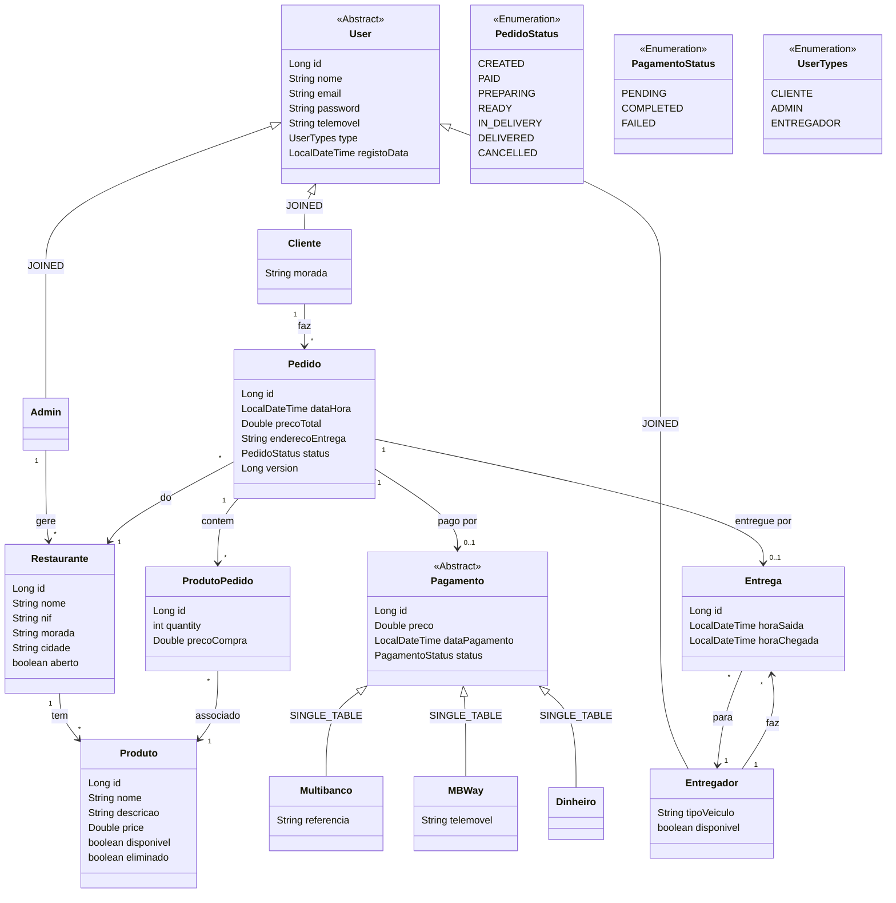
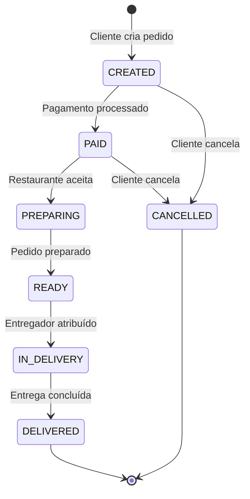

# TascaEats — Modelo de Domínio

## Diagrama de Classes

## Fluxo de Estados do Pedido

## Estratégias de Herança JPA

| Hierarquia | Estratégia | Justificação |
|-----------|------------|--------------|
| `User` → Cliente, Admin, Entregador | **JOINED** | Subtipos com atributos distintos; queries frequentes por subtipo; melhor normalização |
| `Pagamento` → Multibanco, MBWay, Dinheiro | **SINGLE_TABLE** | Poucos campos diferenciadores; queries polimórficas frequentes; melhor performance |

## Relações Principais

| De | Para | Cardinalidade | Notas |
|----|------|--------------|-------|
| Cliente | Pedido | 1:N | Cliente faz vários pedidos |
| Admin | Restaurante | 1:N | Admin gere vários restaurantes |
| Entregador | Entrega | 1:N | Entregador faz várias entregas |
| Restaurante | Produto | 1:N | Restaurante tem vários produtos |
| Pedido | ProdutoPedido | 1:N | Pedido contém vários items |
| ProdutoPedido | Produto | N:1 | Item referencia um produto |
| Pedido | Pagamento | 1:1 | Pedido tem um pagamento |
| Pedido | Entrega | 1:1 | Pedido tem uma entrega |
| Pedido | Restaurante | N:1 | Pedido é de um restaurante |

## Regras de Integridade

- **Soft-delete** em `Produto`: se tem pedidos associados, marca `eliminado=true` em vez de apagar
- **Optimistic locking** em `Pedido`: campo `@Version` para controlo de concorrência
- **`precoCompra`** em `ProdutoPedido`: captura o preço no momento da compra (imutável)
- **`disponivel`** em `Entregador`: controla disponibilidade para novas entregas
