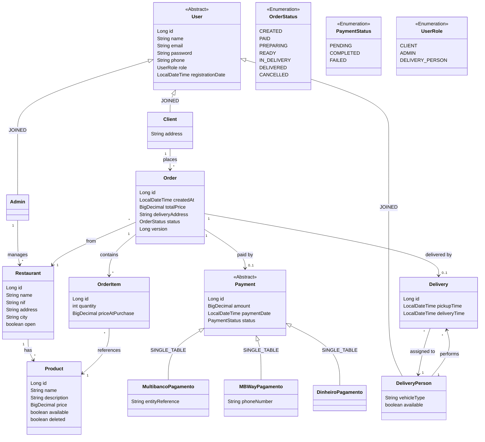
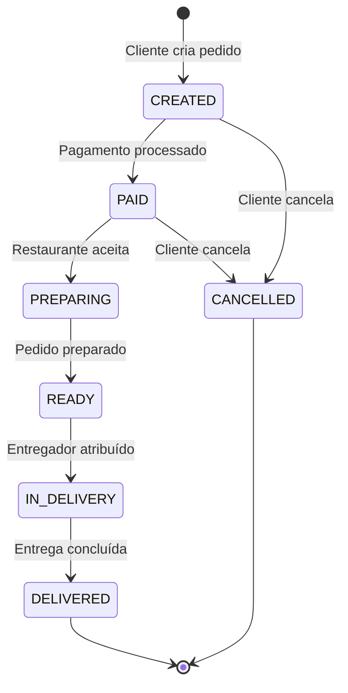

# TascaEats — Modelo de Domínio

## Diagrama de Classes

## Fluxo de Estados do Pedido

## Estratégias de Herança JPA

| Hierarquia | Estratégia | Justificação |
|-----------|------------|--------------|
| `User` → Client, Admin, DeliveryPerson | **JOINED** | Subtipos com atributos distintos; queries frequentes por subtipo; melhor normalização |
| `Payment` → Multibanco, MBWay, Dinheiro | **SINGLE_TABLE** | Poucos campos diferenciadores; queries polimórficas frequentes; melhor performance |

## Relações Principais

| De | Para | Cardinalidade | Notas |
|----|------|--------------|-------|
| Client | Order | 1:N | Cliente faz vários pedidos |
| Admin | Restaurant | 1:N | Admin gere vários restaurantes |
| DeliveryPerson | Delivery | 1:N | Entregador faz várias entregas |
| Restaurant | Product | 1:N | Restaurante tem vários produtos |
| Order | OrderItem | 1:N | Pedido contém vários items |
| OrderItem | Product | N:1 | Item referencia um produto |
| Order | Payment | 1:1 | Pedido tem um pagamento |
| Order | Delivery | 1:1 | Pedido tem uma entrega |
| Order | Restaurant | N:1 | Pedido é de um restaurante |

## Regras de Integridade

- **Soft-delete** em `Product`: se tem pedidos associados, marca `deleted=true` em vez de apagar
- **Optimistic locking** em `Order`: campo `@Version` para controlo de concorrência
- **`priceAtPurchase`** em `OrderItem`: captura o preço no momento da compra (imutável)
- **`available`** em `DeliveryPerson`: controla disponibilidade para novas entregas
